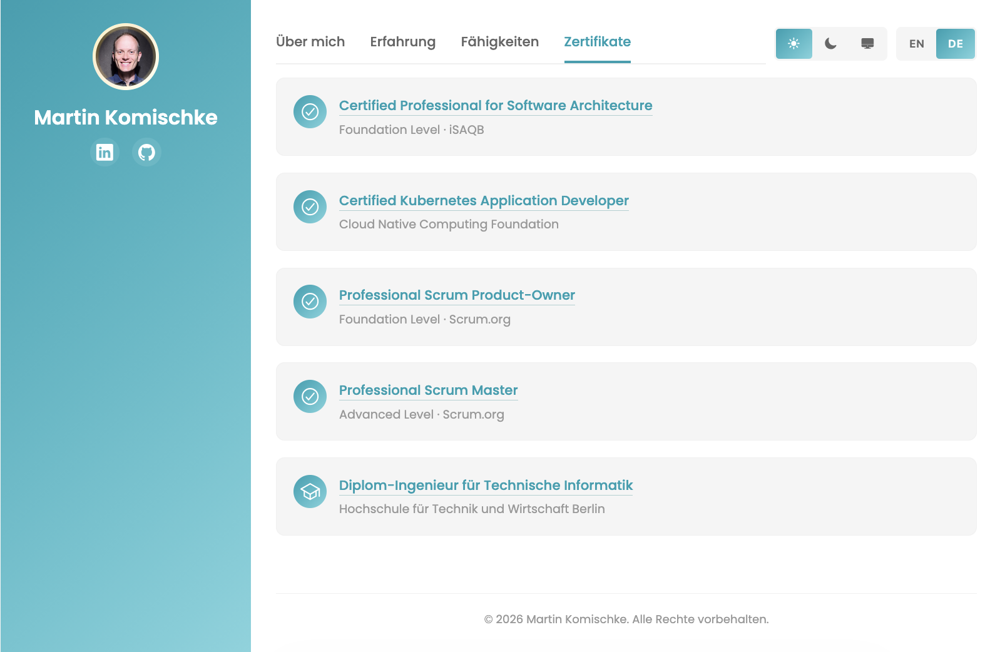
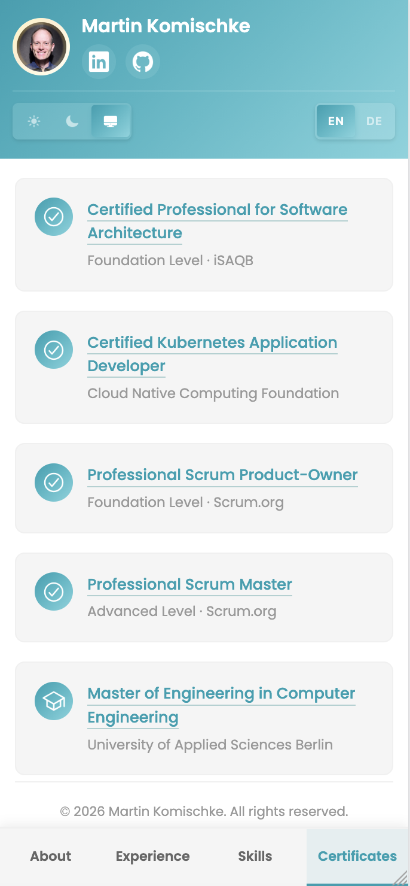

# Personal Portfolio

A responsive personal portfolio website showcasing professional experience, skills, and certificates. Available in English and German.

**Live Site:** https://makomweb.github.io

## Screenshot

<p align="center">
  
  
</p>


## Local Development

To test the website locally, use Python's built-in HTTP server:

```bash
# Navigate to the repository directory
cd <working-directory>

# Start local server (Python 3)
python3 -m http.server 8000
```

Then open your browser and visit: **http://localhost:8000**

## How to Contribute

Feel free to fork this repository and submit pull requests for improvements!

## License

See [LICENSE.md](LICENSE.md) for details.
