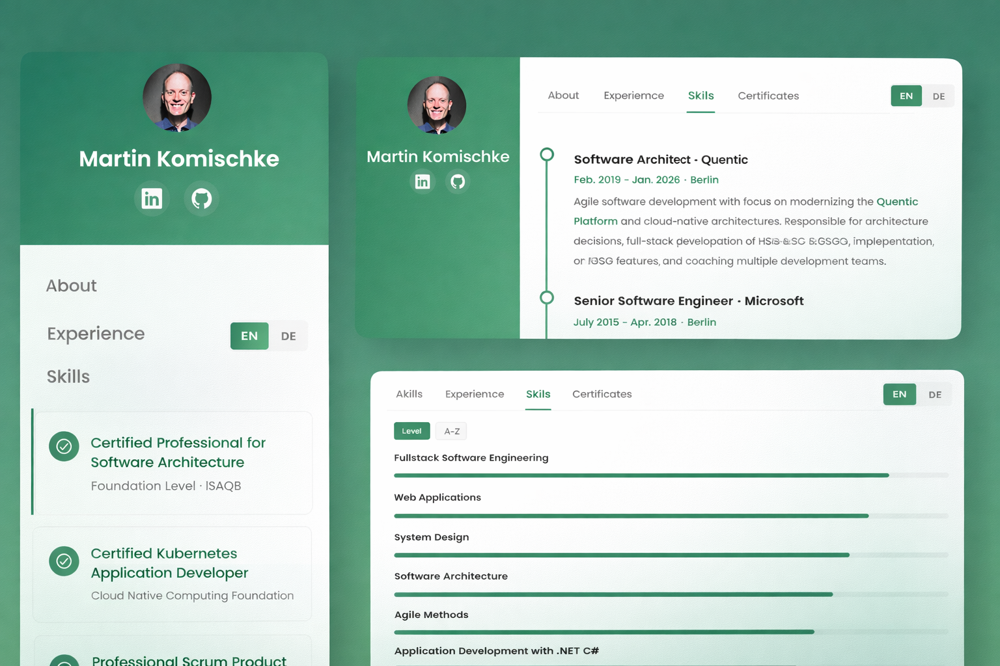

# Personal Portfolio

A responsive personal portfolio website showcasing professional experience, skills, and certificates. Available in English and German.

**Live Site:** https://makomweb.github.io

## Features

- 📱 **Responsive Design** – Optimized for both mobile and desktop devices
- 🌍 **Multi-language Support** – Available in English and German
- 🎨 **Modern UI** – Clean, professional interface with smooth interactions
- 📄 **Complete Portfolio** – About, experience, skills, and certificates sections

## Screenshots



## Technologies

- HTML5
- CSS3
- Vanilla JavaScript
- Responsive Design
- GitHub Pages

## Project Structure

```
├── index.html              # Main page
├── about.html              # About section
├── experience.html         # Work experience
├── skills.html             # Technical skills
├── certificates.html       # Certifications
├── style.css               # Global styles
├── script.js               # Main scripts
├── load-sidebar.js         # Sidebar loader
├── translations.js         # Language translations
└── images/                 # Screenshots and assets
```

## How to Contribute

Feel free to fork this repository and submit pull requests for improvements!

## License

See [LICENSE.md](LICENSE.md) for details.
